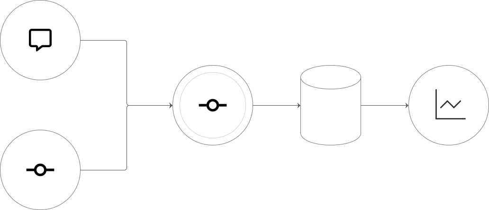
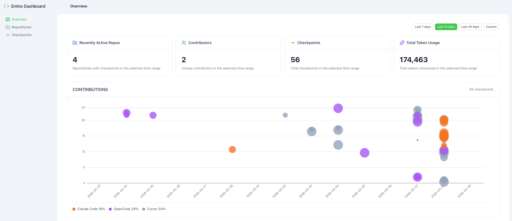

<h2 align="center">Every commit tells a story, and now you can see it.</h2>

# Entire Dashboard

A web-based analytics and visualization dashboard for data generated by [`entireio/cli`](https://github.com/entireio/cli).

**Supported platforms:** GitLab, GitHub, and Gitee.

### System Architecture

<p align="center">
  
</p>

Overall workflow: capturing conversations and events from the CLI, processing and storing them in MySQL through the core service, then visual analysis through the Dashboard.

## 📁 Project Structure

| Directory | Stack | Description |
|-----------|-------|-------------|
| `web/` | Vue 3 + Nuxt 4 | Frontend SPA (Single Page Application) |
| `server/` | Spring Boot + MySQL | Backend REST API server |

## 📋 Prerequisites

- **Java 25** (for backend)
- **Node.js 24** (for frontend, [Volta](https://volta.sh/) recommended)
- **MySQL 8**
- **pnpm 10** (for frontend; npm/yarn also work)

## 🔧 Installation & Run

### 0. Install Entire CLI

This dashboard ingests data generated by the Entire CLI. Install Entire first from the [official website](https://entire.io/home):

```bash
curl -fsSL https://entire.io/install.sh | bash
```

After installation, set up the CLI in your repository to start capturing AI agent sessions. See [entireio/cli](https://github.com/entireio/cli) for more details.

### 1. Prepare MySQL Database

Create the database before starting the backend:

```sql
CREATE DATABASE `entire-dashboard` CHARACTER SET utf8mb4 COLLATE utf8mb4_general_ci;
```

Flyway will automatically run migrations when the backend starts.

### 2. Backend (Spring Boot + MySQL)

```bash
cd server/
```

1. **Copy environment template**:
   ```bash
   cp .env.dist .env
   ```

2. **Edit `.env`** and set your MySQL credentials:
   ```env
   DB_HOST=localhost
   DB_PORT=3306
   DB_NAME=entire-dashboard
   DB_USERNAME=root
   DB_PASSWORD=your_password

   JWT_SECRET=ChangeThisSecretKeyInProduction

   APP_USERNAME=admin
   APP_PASSWORD=admin
   ```

3. **Run the server**:
   ```bash
   ./gradlew bootRun
   ```

   The API runs at **http://localhost:8080**.
   - Swagger UI: http://localhost:8080/swagger-ui.html

### 3. Frontend (Vue + Nuxt)

```bash
cd web/
```

1. **Install dependencies**:
   ```bash
   pnpm install
   ```

2. **Start development server**:
   ```bash
   pnpm dev
   ```

   The frontend runs at **http://localhost:3001**.

   In dev mode, API requests to `/api/v1/**` are proxied to `http://127.0.0.1:8080/api/v1/**`. Ensure the backend is running first.

### 4. Production Build

**Backend** (JAR):
```bash
cd server/
./gradlew bootJar
java -jar build/libs/entire-dashboard-*.jar
```

**Frontend** (static export or SSR):
```bash
cd web/
pnpm build
# Serve with: pnpm preview  (or deploy build output)
```

## 🚀 Quick Start (Usage)

Once the system is up and running:

1. Go to **Repositories**, add a repository, and sync its data.
2. Visit **Overview / Checkpoints** to explore your synced data.

## 📸 Screenshots

<p align="center">
  
</p>

The dashboard provides a comprehensive view of your AI agent sessions, showing checkpoint history, commit activity, and repository statistics at a glance.